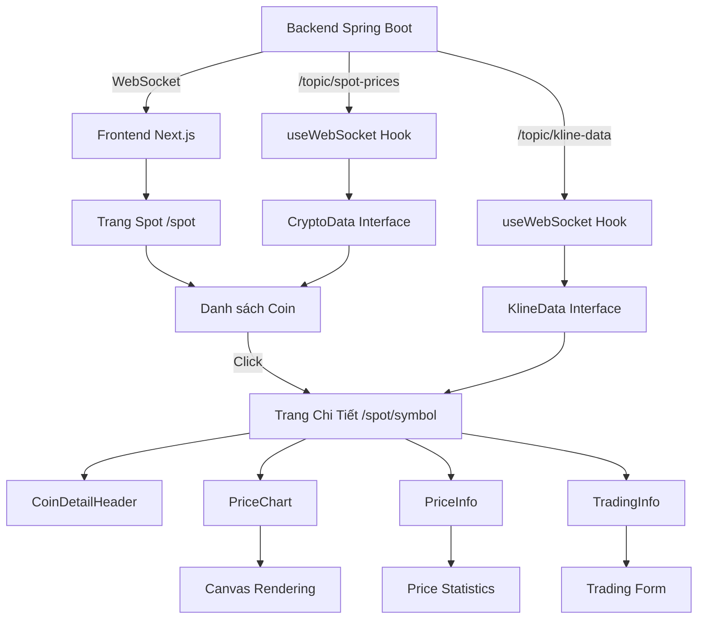
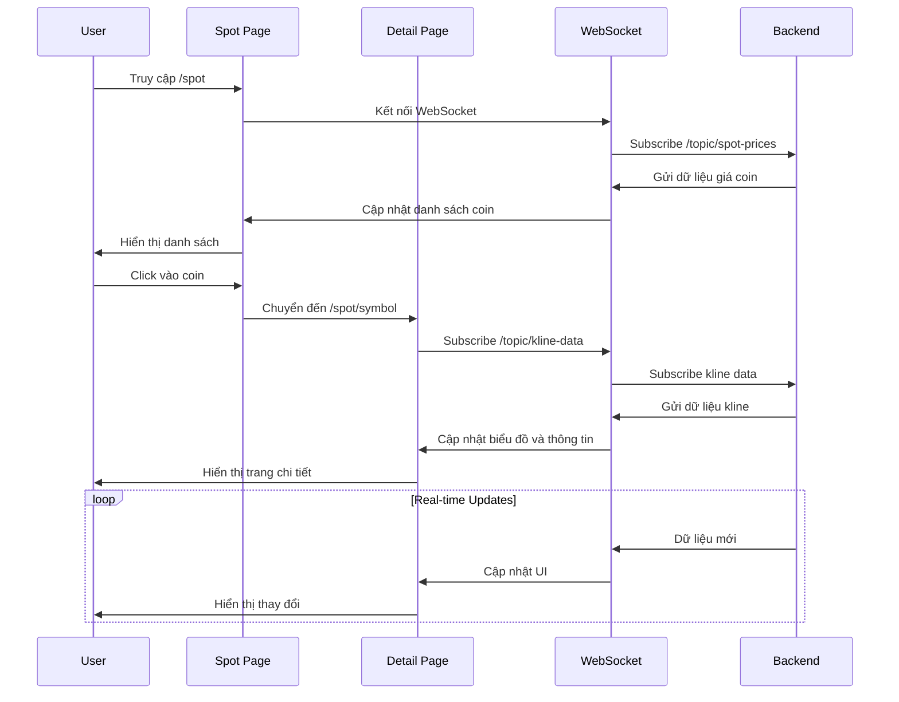
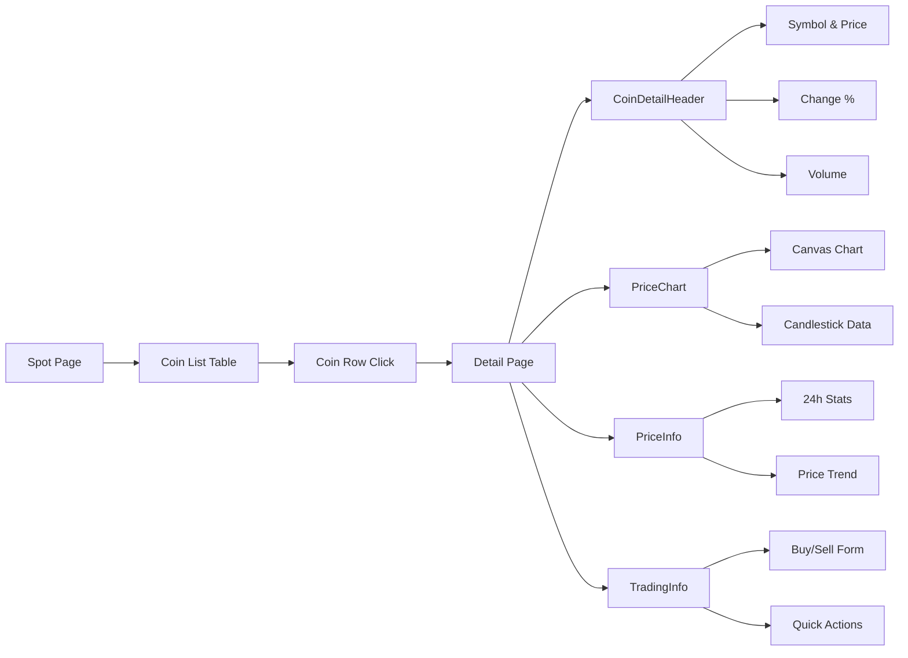
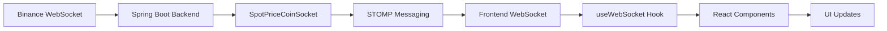
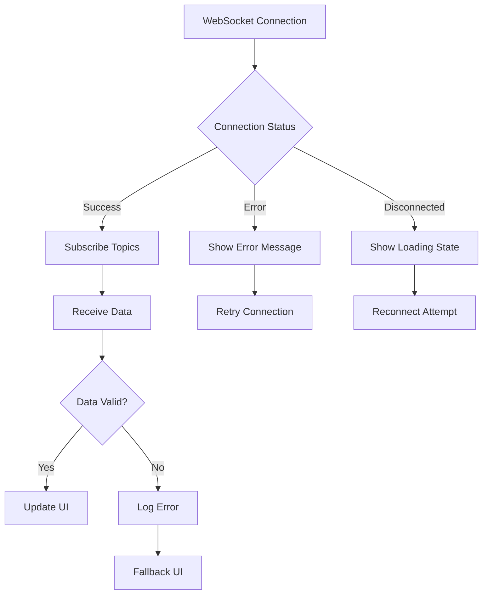
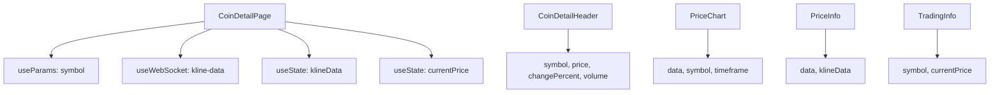
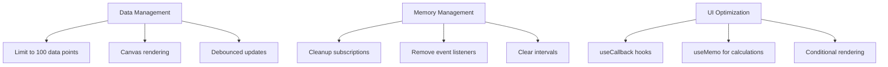

# Luồng hoạt động hệ thống Spot Trading

## Diagram luồng dữ liệu



## Luồng người dùng



## Cấu trúc Component



## WebSocket Topics

```mermaid
graph TD
    A[Backend SpotPriceCoinSocket] --> B[/topic/spot-prices]
    A --> C[/topic/kline-data]
    
    B --> D[Frontend Spot Page]
    C --> E[Frontend Detail Page]
    
    D --> F[CryptoData Interface]
    E --> G[KlineData Interface]
    
    F --> H[Price List Display]
    G --> I[Chart Rendering]
    G --> J[Price Statistics]
```

## Data Flow



## Error Handling Flow



## Component Props & State



## Performance Optimizations


